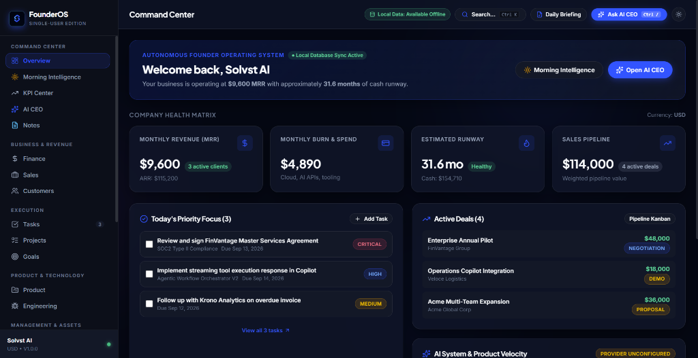
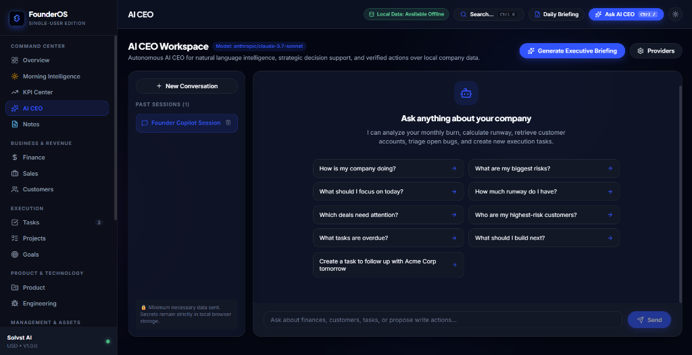
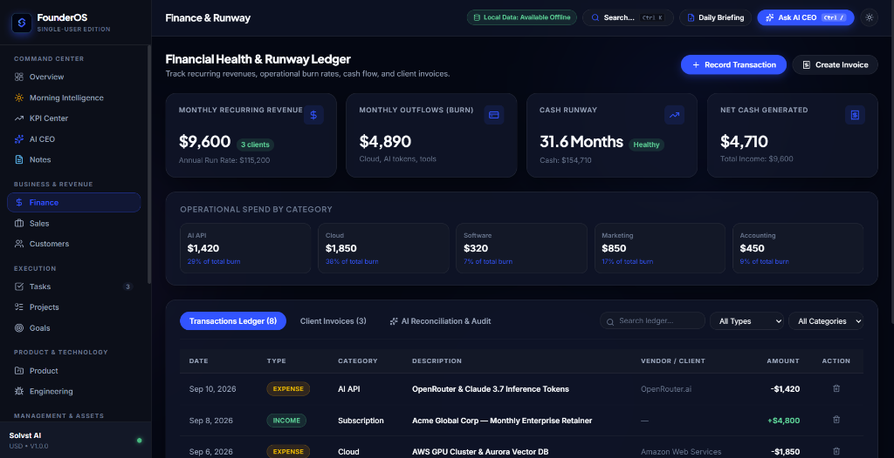
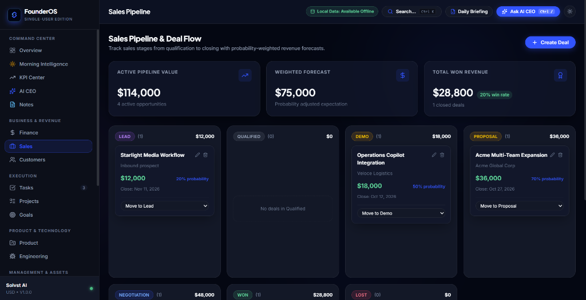
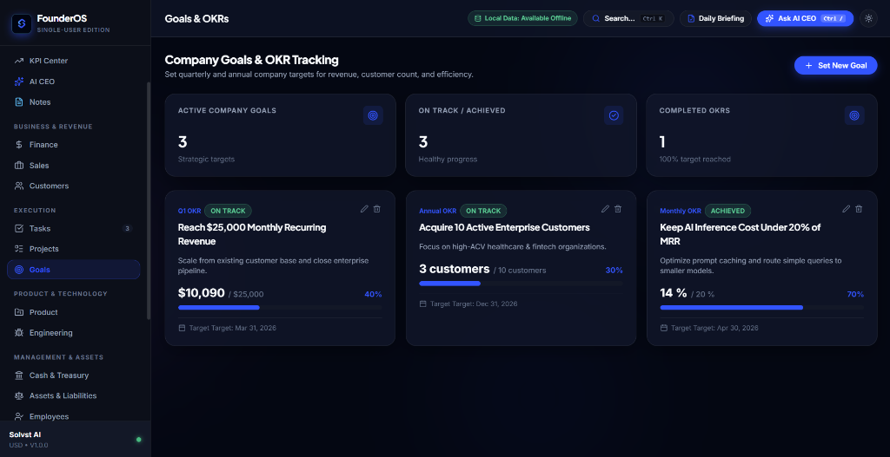

<p align="center">
  
</p>

<h1 align="center">FounderOS</h1>

<p align="center">
  <strong>The Autonomous AI Operating System for Solo Founders & High-Velocity Startups.</strong>
</p>

<p align="center">
  <em>Engineered to eliminate founder bottlenecks. Designed to feel like magic. 100% Local-First.</em>
</p>

<p align="center">
  <a href="#-the-autonomous-ai-ceo"></a>
  <a href="#-built-for-absolute-privacy"></a>
  <a href="#-keyboard-driven-velocity"></a>
  <a href="#-quick-start"></a>
  <a href="#license"></a>
</p>

---

<p align="center">
  
</p>

---

## ✦ Why FounderOS?

As a solo founder or early-stage CEO, **context switching is your silent killer**. You jump between accounting spreadsheets, CRM boards, task managers, and PRD documents, spending hours manually linking deals to invoices and tasks to customers.

**FounderOS changes everything.** It unifies your entire startup into a single, high-contrast, local-first cockpit powered by an **Autonomous AI CEO**. 

Instead of typing data across 6 different SaaS tabs, you simply talk to your AI CEO. It queries your local database, drafts multi-module action plans, provisions customers, issues invoices, prioritizes tasks, and executes verified database mutations in a single click—complete with **1-click Auto-Undo rollback**.

> *"What macOS did for personal computing, FounderOS does for running a company."*

---

## 🌟 Flagship Experiences

### 1. Executive Command Center
*Your company’s heartbeat. Measured in real time.*

The Command Center aggregates your core vital signs without you ever having to configure a query:
- **Company Health Matrix**: Real-time Monthly Recurring Revenue (MRR), ARR, Net Cash Generated, and Monthly Burn Velocity.
- **Dynamic Runway Engine**: Calculates exact remaining cash runway down to the decimal based on your real IndexedDB balance sheet and recurring burn rate.
- **Today's Priority Focus**: Pinned high-leverage execution items with severity badges (`CRITICAL`, `HIGH`, `MEDIUM`).
- **Active Deals & Pipeline Preview**: Live snapshot of high-value opportunities moving through your funnel.
- **Morning Intelligence**: One-click synthesis of your day's agenda, overdue invoices, at-risk accounts, and urgent bug triage.

---

### 2. The Autonomous AI CEO
*Not just another chatbot. An executive operating partner.*

<p align="center">
  
</p>

The **AI CEO Workspace** is engineered with deep system-level tool calling capabilities. It has read access to your local company database and can propose structured, reversible write actions:

- **Conversational Intelligence**: Ask complex analytical questions like *"How much runway do I have if burn increases 20%?"*, *"Which deals stalled this week?"*, or *"Run my Monday Revenue War Room"*.
- **1-Click Auto-Provisioning Cards**: When you say *"Got a client for $8,000 building website"*, the AI CEO generates an interactive **Client & Project Intake Card**. Approving it atomically provisions the customer in CRM, logs the won deal, generates the invoice, creates 5 milestone tasks, and syncs your revenue OKR.
- **Persistent Approvals & 1-Click Auto-Undo**: Made a decision or accepted a proposal? It stays approved across chat switches and page refreshes. Changed your mind? Hit **[Undo Decision]** to cleanly cascade and roll back all created records instantly.
- **Background Chat Execution**: Navigate freely between pages while the AI CEO runs. The execution continues in the background, showing a pulsating `⚡ AI CEO Working` pill in the navigation bar, and automatically updates the chat when complete.

---

### 3. Financial Health & Runway Ledger
*Runway calculations with surgical precision.*

<p align="center">
  
</p>

- **Double-Entry Transactions Ledger**: Granular tracking of income, subscriptions, and vendor outflows.
- **Categorical Spend Analytics**: Automatic breakdown of burn rates into AI API, Cloud Infrastructure, Software Subscriptions, Marketing, and Accounting.
- **Client Invoicing & Factoring**: Track invoice statuses (`paid`, `unpaid`, `overdue`), due dates, and automated reminders.
- **AI Financial Reconciliation**: Detect anomalies, duplicate charges, or runaway API consumption before they dent your runway.

---

### 4. Sales Pipeline & Deal Flow Kanban
*From inbound interest to closed revenue.*

<p align="center">
  
</p>

- **Interactive Kanban Columns**: Drag and drop deals across `Lead`, `Qualified`, `Demo`, `Proposal`, `Negotiation`, `Won`, and `Lost`.
- **Weighted Forecast Intelligence**: Probability-weighted revenue pipeline forecasting based on current deal stages.
- **Quick Deal Creator**: Instant deal valuation, target close dates, and linked customer accounts.

---

### 5. Goals & OKRs Tracking
*Clarity of vision. Relentless execution.*

<p align="center">
  
</p>

- **Quarterly & Annual Objectives**: Track macro targets like *"Reach $25,000 MRR"* or *"Acquire 10 Active Enterprise Customers"*.
- **Dynamic Progress Velocity**: Live progress bars updating automatically as underlying deals close and invoices clear.
- **Founder Alignment Sync**: Link day-to-day sprint tasks directly to overarching company key results.

---

## ⚡ 11 Pre-Engineered Revenue & Efficiency Engines

FounderOS includes 11 specialized autonomous workflows ready out of the box:

| # | Autonomous Workflow | Founder Trigger Prompt | Multi-Module Actions Executed |
|---|---------------------|------------------------|-------------------------------|
| 1 | **Instant Client Intake** | *"Got a client for $5,000 building website"* | Provisions Customer, Deal, Invoice, 5 Milestone Tasks, Kickoff Note, OKR sync |
| 2 | **Stalled Deal Win-Back** | *"Re-engage stalled deals over $1,500"* | Advances deals to Negotiation, drafts 48h follow-up tasks, creates Win-Back playbook |
| 3 | **Overdue Invoice Recovery** | *"Chase overdue invoices and collect cash"* | Audits accounts receivable, tags customers `payment_delayed`, schedules wire check-in |
| 4 | **Customer Retainer Expansion** | *"Find top clients and pitch retainer upsell"* | Launches Expansion deal, tags customer, generates 1-page proposal memo, updates MRR OKR |
| 5 | **Scope-Creep Defense** | *"Client wants mobile app added without paying"* | Issues Change Order invoice, extends project timeline, drafts 3-option counter memo |
| 6 | **Monday Revenue War Room** | *"Run my Monday Revenue War Room"* | Synthesizes cash pulse, calculates runway, pins Top 3 CEO priority tasks for the week |
| 7 | **Customer Risk Mitigation** | *"Client Acme is at risk of churning"* | Flags customer `at_risk`, creates P0 escalation bug, schedules founder retention call |
| 8 | **Employee Ramp Onboarding** | *"Hired Sarah as Senior Fullstack Engineer"* | Creates employee record, logs payroll outflow, schedules 30/60/90-day onboarding milestones |
| 9 | **Feature Sprint Launch** | *"Launch sprint for Stripe billing integration"* | Creates product backlog feature, generates technical PRD, populates 4 development subtasks |
| 10 | **Vendor Expense Audit** | *"Subscribed to Datadog for $450/month"* | Logs recurring operational outflow, categorizes spend, schedules 30-day ROI audit task |
| 11 | **Executive Investor Report** | *"Generate monthly investor update"* | Aggregates MRR growth, net burn, product milestones, and compiles founder memo |

*Every workflow features atomic rollback with the **Undo Decision** button.*

---

## 🔒 Built for Absolute Privacy

```
┌─────────────────────────────────────────────────────────────┐
│                       FOUNDEROS APP                         │
│   (100% Frontend Client-Side Single Page Application)       │
└──────────────────────────────┬──────────────────────────────┘
                               │
               Direct, Local IndexedDB Access
                               ▼
┌─────────────────────────────────────────────────────────────┐
│                 BROWSER INDEXEDDB (DEXIE)                   │
│   • 16 Structured Company Tables                            │
│   • API Keys & Credentials Encrypted in Local Storage       │
│   • Zero Cloud Telemetry • Zero External Databases          │
└─────────────────────────────────────────────────────────────┘
```

- **Zero Cloud Databases**: All transactions, customer contacts, sales pipelines, and financials are stored **strictly on your machine** in browser IndexedDB.
- **Zero Intermediary Proxies**: Calls to AI models (via OpenRouter or your custom OpenAI endpoint) are dispatched **directly from your browser**. Your API keys never touch any intermediary backend.
- **Offline Capable**: Airplane mode? Spotty Wi-Fi? FounderOS works seamlessly offline. When offline, all database features, calculators, and task boards remain fully interactive.
- **Complete Data Ownership**: Export your entire company database as an encrypted JSON archive anytime with one click, or import previous backups instantly.

---

## ⌨️ Keyboard-Driven Velocity

Designed for power users who refuse to touch the mouse:

| Shortcut | Action | Description |
|----------|--------|-------------|
| <kbd>Ctrl</kbd> + <kbd>K</kbd> / <kbd>Cmd</kbd> + <kbd>K</kbd> | **Universal Command Palette** | Fuzzy search across all customers, deals, tasks, notes, and pages |
| <kbd>Ctrl</kbd> + <kbd>/</kbd> / <kbd>Cmd</kbd> + <kbd>/</kbd> | **AI CEO Slide-Over Drawer** | Summon the AI CEO instantly over any screen without losing context |
| <kbd>Enter</kbd> | **Execute / Confirm** | Dispatch chat queries, submit intake forms, and trigger workflows |

---

## 🛠️ Architecture & Tech Stack

FounderOS is engineered using high-performance, modern web technologies:

- **Core Framework**: React 19 + TypeScript 5
- **Build Tool**: Vite 6 (sub-second hot module reload, <5s production builds)
- **Local Database**: Dexie.js (IndexedDB wrapper with reactive `useLiveQuery` subscriptions)
- **Icons & Visuals**: Lucide Icons
- **Design System**: Handcrafted Solvst aesthetic—Midnight Obsidian canvas (`#030712`), Electric Accent (`#0050FF`), Cyan highlights (`#38bdf8`), and glassmorphism backdrop filters.
- **AI Integrations**: OpenRouter, Anthropic Claude 3.7 Sonnet, OpenAI GPT-4o, Ollama, LocalAI.

---

## 🚀 Quick Start

Get your personal founder operating system running in under 60 seconds:

### 1. Clone the Repository
```bash
git clone https://github.com/arvindvadivelu/FounderOS.git
cd FounderOS
```

### 2. Install Dependencies
```bash
npm install
```

### 3. Launch Development Environment
```bash
npm run dev
```
Open **[http://localhost:5173](http://localhost:5173)** in your browser.

### 4. Build for Production
```bash
npm run build
```
Generates production-ready, ultra-optimized static assets in `dist/`.

---

## 🌐 Deploy Anywhere (Static & Free)

Because FounderOS requires **zero backend servers**, you can deploy it to any static hosting service for free:

### Deploy to Netlify
1. Connect your GitHub repository to [Netlify](https://www.netlify.com).
2. Set Build Command: `npm run build`
3. Set Publish Directory: `dist`
4. *Routing is already configured via `public/_redirects`.*

### Deploy to Vercel
```bash
npx vercel
```

### Deploy to GitHub Pages
Build the production bundle and deploy the `dist/` directory to your `gh-pages` branch.

---

## ⚙️ AI Provider Setup

1. Open FounderOS and click **Settings** (or the gear icon in the bottom-left corner).
2. Select the **AI Providers** tab.
3. Configure your provider:
   - **Provider Type**: `OpenRouter` or `OpenAI Compatible`
   - **Base URL**: `https://openrouter.ai/api/v1` (or local `http://localhost:11434/v1`)
   - **API Key**: `sk-or-v1-...`
   - **Default Model**: `anthropic/claude-3.7-sonnet` (or any model of your choice)
4. Click **[Test Connection]** to verify latency and connectivity.
5. Click **[Save Provider]**. You are now ready to unleash your AI CEO.

---

## 🧪 Comprehensive Automated Test Suites

FounderOS maintains stringent test coverage across all domain services, AI tool dispatchers, background execution engines, and auto-undo rollbacks:

```bash
# Run Background Chat & Navigation Sync Suite (24 tests)
npx tsx src/background_chat_test_suite.ts

# Run Approval Persistence & Auto-Undo Suite (12 tests)
npx tsx src/undo_actions_test_suite.ts

# Run Revenue Booster & Efficiency Suite (13 tests)
npx tsx src/revenue_engines_test_suite.ts

# Run Core Database & CRUD Suite
npx tsx src/test_suite.ts
```

---

## 📄 License

Distributed under the **MIT License**. See `LICENSE` for more information.

---

<p align="center">
  <strong>Built with relentless attention to detail for founders who build the future.</strong><br/>
  <sub>FounderOS is 100% open source and privacy-first.</sub>
</p>
