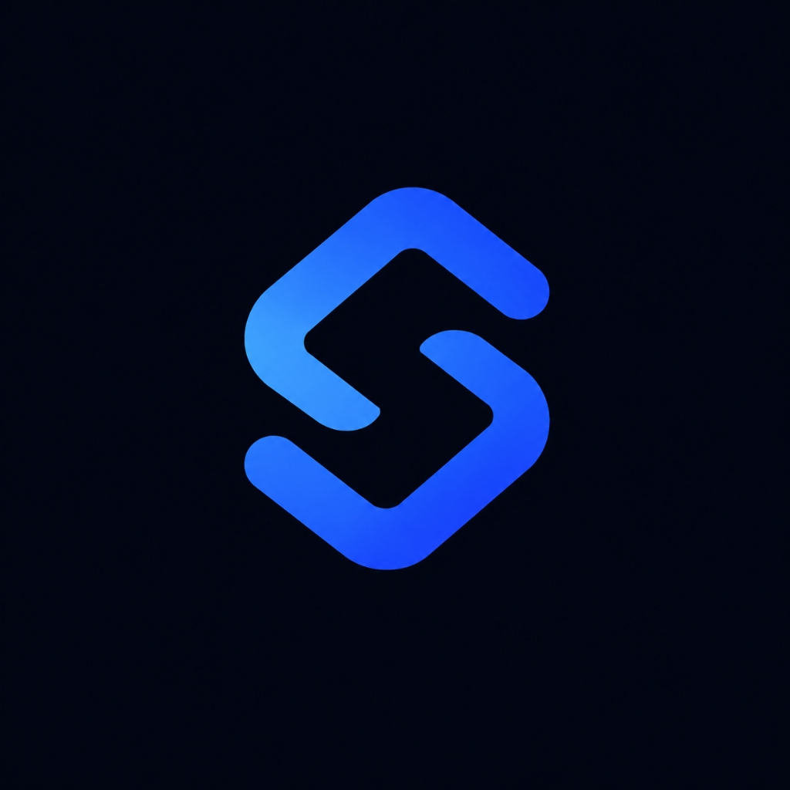

<p align="center">
  
</p>

<h1 align="center">FounderOS — Native Desktop Edition</h1>

<p align="center">
  <strong>The Autonomous AI Operating System for Solo Founders, Packaged as a High-Performance Native Desktop App.</strong>
</p>

<p align="center">
  <em>Frameless Glassmorphic Windowing • Resident System Tray • Global OS Hotkey Summon • 100% Local-First.</em>
</p>

<p align="center">
  
  
  
  
</p>

---

<p align="center">
  
</p>

---

## ✦ Native Desktop Highlights

### 1. Frameless Obsidian Windowing
- Custom-built, pixel-perfect dark glassmorphic titlebar seamlessly integrated with FounderOS's midnight obsidian canvas (`#030712`).
- Integrated window controls: Minimize (`-`), Maximize / Restore (`□`), and Close to Tray (`✕`).
- Smooth draggable window region and persistent window size & position memory.

### 2. Resident System Tray Integration
- Lives discreetly in your Windows taskbar notification tray.
- Instant right-click context menu:
  - 🚀 **Open FounderOS**
  - ☀️ **Morning Intelligence Briefing**
  - ⚡ **Ask AI CEO Workspace**
  - 💰 **Financial Health & Runway**
  - ❌ **Quit FounderOS**
- Double-click the tray emblem anytime to bring FounderOS to the front.

### 3. Global OS Summon Hotkey (<kbd>Ctrl</kbd> + <kbd>Shift</kbd> + <kbd>O</kbd>)
- Working in Chrome, VS Code, Figma, or Excel? Press <kbd>Ctrl</kbd> + <kbd>Shift</kbd> + <kbd>O</kbd> from anywhere in your operating system to summon FounderOS instantly over your current workspace. Press it again to dismiss it.

### 4. Native Desktop Push Notifications
- Receive OS desktop notifications when long-running AI CEO background tasks finish synthesizing, or when invoices become overdue.

### 5. 100% Local-First & Air-Gapped Capable
- Uses Chromium's native IndexedDB (Dexie engine) stored securely on your local disk under `%APPDATA%/FounderOS`.
- Zero cloud telemetry, zero external database servers, and zero data leakage.

---

## 🚀 Quick Start (Development)

### 1. Install Dependencies
```bash
cd desktop
npm install
```

### 2. Launch in Desktop Development Mode
```bash
npm run dev
```
*This starts Vite on `http://localhost:5173` and boots Electron simultaneously with hot-reloading.*

---

## 📦 Packaging Standalone Windows `.exe`

To package FounderOS into a distributable Windows application:

```bash
npm run package:win
```

This compiles the React renderer, builds the Electron main process, and runs `electron-builder` to generate:
- **NSIS Installer**: `release/FounderOS Setup 1.0.0.exe` (Complete Windows installer with Start Menu & Desktop shortcuts)
- **Portable Executable**: `release/FounderOS 1.0.0.exe` (Zero-install standalone executable, runs directly from USB or anywhere)

---

## 📂 Desktop Architecture

```
desktop/
├── electron/
│   ├── main.ts              # Native window, System Tray, Global Hotkey, IPC handlers
│   └── preload.ts           # Secure ContextBridge exposing desktop APIs
├── src/
│   ├── desktop/
│   │   ├── DesktopTitlebar.tsx   # Custom frameless titlebar with window controls
│   │   └── useDesktopBridge.ts   # React hook for native window & notification actions
│   ├── ai/                  # AI CEO Engine, tools, 11 revenue workflows, background runner
│   ├── components/          # Glassmorphic UI components, AppShell, Topbar, Sidebar
│   ├── db/                  # Dexie local IndexedDB database schema and services
│   └── pages/               # Command Center, AI CEO, Finance, Sales, Tasks, OKRs
├── public/                  # Static assets & brand emblem
├── docs/assets/             # High-resolution showcase screenshots
├── vite.config.ts           # Configured with relative base path for Electron file:// protocol
├── tsconfig.json            # Renderer TypeScript config
├── tsconfig.electron.json   # Electron main & preload TypeScript config
└── package.json             # Electron & builder configuration
```

---

## ⌨️ Desktop Shortcuts

| Shortcut | Scope | Action |
|----------|-------|--------|
| <kbd>Ctrl</kbd> + <kbd>Shift</kbd> + <kbd>O</kbd> | **Global (OS-wide)** | Summon / Dismiss FounderOS from anywhere in Windows |
| <kbd>Ctrl</kbd> + <kbd>K</kbd> | In-App | Universal Command Palette across all 12+ company entities |
| <kbd>Ctrl</kbd> + <kbd>/</kbd> | In-App | Slide-Over AI CEO Quick Drawer |
| <kbd>Alt</kbd> + <kbd>F4</kbd> | In-App | Close window to System Tray |

---

<p align="center">
  <strong>FounderOS Desktop Edition • Engineered with relentless attention to detail for founders who build the future.</strong>
</p>
